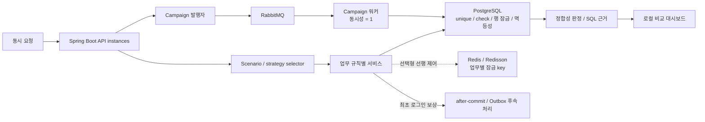

# Member Event Consistency

Member Event Consistency는 회원 보상, 쿠폰 발급, 포인트 차감처럼 같은 업무 식별자에 요청이 겹칠 때 어떤 정합성 규칙이 깨지는지 재현하고 제어 방식을 비교하는 Java/Spring 백엔드 프로젝트입니다. 모든 회원 작업을 하나의 전역 잠금으로 묶지 않고, 업무 규칙별 PostgreSQL 제약·행 잠금을 최종 방어선으로 두며 Redis 잠금과 RabbitMQ 워커를 선택적으로 결합합니다.

핵심 비교 대상은 최초 로그인 보상, 쿠폰 캠페인 발급, 포인트 사용 세 시나리오입니다. 로컬 실행 도구와 JUnit은 제어 방식별 결과를 비교하고, Testcontainers는 PostgreSQL 동시성 및 RabbitMQ 캠페인 경로를 실제 의존성으로 확인합니다.

## 한눈에 보기

| 항목 | 내용 |
|---|---|
| 문제 | 중복 지급, 캠페인 초과 발급, 포인트 음수 잔액, 재시도 중복 차감을 업무 규칙별로 방지 |
| 핵심 구현 | PostgreSQL unique/check 제약과 행 잠금, 멱등성 key, Redisson 잠금, RabbitMQ 단일 워커 처리 경로, 보상 Outbox 후속 처리 |
| 기술 | Java 17, Spring Boot 3.3, PostgreSQL 16, Redis 7, RabbitMQ, Flyway, Testcontainers |
| 핵심 비교 | 최초 로그인 보상 (`FIRST_LOGIN_REWARD`), 쿠폰 캠페인 발급 (`COUPON_CAMPAIGN_ISSUE`), 포인트 사용 (`POINT_SPEND`) |
| 후속 구현 | 쿠폰 사용과 멱등 재전송, 만료 배치와 실시간 사용 경합 |
| 담당 | 개인 프로젝트로 시나리오 모델, 저장소, 제어 장치, API, 테스트 실행 도구와 로컬 인프라를 직접 구현 |
| 범위 | 로컬 기능·동시성 검증이며 운영 규모 성능, 고가용성, 외부 제공자 연동은 포함하지 않음 |

## 아키텍처



Redis와 RabbitMQ는 PostgreSQL 앞의 선택형 제어 장치입니다. Redis 잠금 key는 보상은 회원, 쿠폰은 캠페인 단위로 분리하고, RabbitMQ 워커는 로컬 MVP에서 동시성 `1`로 실행합니다. 이 구성이 일반적인 업무 식별자 순서 보장이나 처리량 개선을 자동으로 제공한다는 의미는 아닙니다.

## 핵심 설계 판단

| 판단 | 적용 방식 | 구현 근거 | 테스트 근거 |
|---|---|---|---|
| 잠금 기술보다 업무 규칙을 먼저 고정 | 각 시나리오가 중복·초과·음수 상태를 별도 정합성 기준으로 판정 | [FirstLoginRewardService](backend/src/main/java/com/example/consistency/reward/FirstLoginRewardService.java), [CouponCampaignService](backend/src/main/java/com/example/consistency/coupon/CouponCampaignService.java), [PointSpendService](backend/src/main/java/com/example/consistency/point/PointSpendService.java) | [InvariantCheckerTest](backend/src/test/java/com/example/consistency/scenario/InvariantCheckerTest.java) |
| PostgreSQL을 최종 방어선으로 유지 | unique/check 제약, `for update`, 조건부 변경, 멱등성 레코드를 사용 | [SqlPointSpendRepository](backend/src/main/java/com/example/consistency/point/SqlPointSpendRepository.java), [Flyway migrations](backend/src/main/resources/db/migration) | [FirstLoginRewardDbConcurrencyIT](backend/src/test/java/com/example/consistency/integration/FirstLoginRewardDbConcurrencyIT.java), [PointSpendDbConcurrencyIT](backend/src/test/java/com/example/consistency/integration/PointSpendDbConcurrencyIT.java) |
| Redis 잠금 key를 업무 식별자로 분리 | 최초 로그인은 `memberId`, 캠페인 발급은 `campaignId` 기반 잠금 key 사용 | [RedisRewardLockGateway](backend/src/main/java/com/example/consistency/web/RedisRewardLockGateway.java), [RedisCouponCampaignLockGateway](backend/src/main/java/com/example/consistency/web/RedisCouponCampaignLockGateway.java) | [FirstLoginRewardConcurrentProbeTest](backend/src/test/java/com/example/consistency/reward/FirstLoginRewardConcurrentProbeTest.java), [CouponCampaignHotCampaignProbeTest](backend/src/test/java/com/example/consistency/coupon/CouponCampaignHotCampaignProbeTest.java)에서 시나리오 결과 비교; Redisson 잠금·해제 직접 검증은 미포함 |
| RabbitMQ 경로와 DB 제약을 함께 검증 | 캠페인 명령을 단일 워커 처리 경로에서 실행한 뒤 DB 발급 결과를 판정 | [CouponCampaignRabbitMqWorker](backend/src/main/java/com/example/consistency/web/CouponCampaignRabbitMqWorker.java), [RabbitMqCouponCampaignScenarioExecutor](backend/src/main/java/com/example/consistency/web/RabbitMqCouponCampaignScenarioExecutor.java) | [RabbitMqCouponCampaignScenarioExecutorTest](backend/src/test/java/com/example/consistency/web/RabbitMqCouponCampaignScenarioExecutorTest.java), [MvpLiveInfrastructureIT](backend/src/test/java/com/example/consistency/integration/MvpLiveInfrastructureIT.java) |
| 보상 후속 처리 경로를 after-commit과 Outbox로 분리 | 보상 저장 후 알림·후속 요청을 두 경로로 기록 | [TransactionalFirstLoginRewardService](backend/src/main/java/com/example/consistency/web/TransactionalFirstLoginRewardService.java), [RewardFollowUpOutboxListener](backend/src/main/java/com/example/consistency/web/RewardFollowUpOutboxListener.java), [SqlRewardOutboxPublisher](backend/src/main/java/com/example/consistency/reward/SqlRewardOutboxPublisher.java) | [SqlRewardOutboxPublisherTest](backend/src/test/java/com/example/consistency/reward/SqlRewardOutboxPublisherTest.java), [FirstLoginRewardServiceTest](backend/src/test/java/com/example/consistency/reward/FirstLoginRewardServiceTest.java); listener의 commit/rollback 동작을 직접 검증하는 통합 테스트는 미포함 |

## 검증 시나리오

### 핵심 비교 3개

| 시나리오 | 보호하는 규칙 | 비교 경로 | 직접 증거 |
|---|---|---|---|
| 최초 로그인 보상 (`FIRST_LOGIN_REWARD`) | 회원당 최초 보상 1회, 중복 후속 처리 방지 | 단순 처리, DB unique, Redis 잠금 + DB unique, after-commit/Outbox | [FirstLoginRewardConcurrentProbe](backend/src/main/java/com/example/consistency/reward/FirstLoginRewardConcurrentProbe.java), [FirstLoginRewardConcurrentProbeTest](backend/src/test/java/com/example/consistency/reward/FirstLoginRewardConcurrentProbeTest.java), [FirstLoginRewardDbConcurrencyIT](backend/src/test/java/com/example/consistency/integration/FirstLoginRewardDbConcurrencyIT.java) |
| 쿠폰 캠페인 발급 (`COUPON_CAMPAIGN_ISSUE`) | 회원당 1회 발급, 캠페인 수량 초과 방지 | DB 방어, Redis 캠페인 잠금, RabbitMQ 워커 + DB 방어 | [CouponCampaignHotCampaignProbe](backend/src/main/java/com/example/consistency/coupon/CouponCampaignHotCampaignProbe.java), [CouponCampaignHotCampaignProbeTest](backend/src/test/java/com/example/consistency/coupon/CouponCampaignHotCampaignProbeTest.java), [MvpLiveInfrastructureIT](backend/src/test/java/com/example/consistency/integration/MvpLiveInfrastructureIT.java) |
| 포인트 사용 (`POINT_SPEND`) | 잔액 음수 방지, 멱등성 key 재전송 중복 차감 방지 | 행 잠금, 조건부 변경, 멱등성 재전송 | [PointSpendConcurrentProbe](backend/src/main/java/com/example/consistency/point/PointSpendConcurrentProbe.java), [PointSpendConcurrentProbeTest](backend/src/test/java/com/example/consistency/point/PointSpendConcurrentProbeTest.java), [PointSpendDbConcurrencyIT](backend/src/test/java/com/example/consistency/integration/PointSpendDbConcurrencyIT.java) |

### 후속 구현 2개

| 시나리오 | 구현 범위 | 증거 |
|---|---|---|
| 쿠폰 사용과 멱등 재전송 | 발급 쿠폰의 사용 전이, 중복 사용 거절, 같은 요청의 재전송 판정을 서비스·SQL 연결 수준에서 검증 | [CouponRedemptionService](backend/src/main/java/com/example/consistency/coupon/CouponRedemptionService.java), [CouponRedemptionScenarioRunnerTest](backend/src/test/java/com/example/consistency/coupon/CouponRedemptionScenarioRunnerTest.java), [SqlCouponRedemptionRepositoryTest](backend/src/test/java/com/example/consistency/coupon/SqlCouponRedemptionRepositoryTest.java) |
| 만료 배치와 실시간 사용 경합 | 만료와 사용이 경쟁할 때 단일 처리 주체를 선택하는 흐름을 서비스·SQL 연결 수준에서 검증 | [BatchExpirationService](backend/src/main/java/com/example/consistency/coupon/BatchExpirationService.java), [BatchExpirationScenarioRunnerTest](backend/src/test/java/com/example/consistency/coupon/BatchExpirationScenarioRunnerTest.java), [SqlBatchExpirationRepositoryTest](backend/src/test/java/com/example/consistency/coupon/SqlBatchExpirationRepositoryTest.java) |

후속 두 시나리오는 구현과 회귀 테스트가 있지만, 위 `*IT` 세 클래스가 제공하는 실제 의존성 검증 범위와는 구분합니다.

## 실제 의존성 검증 범위

| 테스트 | 기동 의존성 | 확인하는 범위 |
|---|---|---|
| [FirstLoginRewardDbConcurrencyIT](backend/src/test/java/com/example/consistency/integration/FirstLoginRewardDbConcurrencyIT.java) | PostgreSQL | 동시 insert에서 unique 제약이 회원당 최초 보상 1건만 허용 |
| [PointSpendDbConcurrencyIT](backend/src/test/java/com/example/consistency/integration/PointSpendDbConcurrencyIT.java) | PostgreSQL | 행 잠금 차감과 음수 잔액 check 제약 |
| [MvpLiveInfrastructureIT](backend/src/test/java/com/example/consistency/integration/MvpLiveInfrastructureIT.java) | PostgreSQL, Redis, RabbitMQ | Spring 상태와 RabbitMQ 쿠폰 캠페인 HTTP 경로의 수량 정합성 |

`MvpLiveInfrastructureIT`는 세 컨테이너를 모두 기동하지만 요청 검증은 RabbitMQ 쿠폰 캠페인 경로에 집중합니다. Redis 잠금 자체의 경합 성능이나 독립적인 실행 동작을 이 테스트 하나로 주장하지 않습니다.

## 재현 방법

### 1. 기본 JUnit

Java 17과 Maven이 필요합니다. 새 clone의 첫 실행은 Maven 의존성을 내려받을 수 있는 네트워크 환경에서 실행합니다. 기본 `test`는 이름이 `*Test`인 회귀 테스트를 실행하며, 실제 시나리오 의존성을 다루는 `*IT`는 별도 명령으로 분리합니다.

```bash
mvn -f backend/pom.xml test
```

기본 테스트에도 Flyway 스키마를 확인하는 `SchemaMigrationTest`가 포함됩니다. Docker가 없으면 이 테스트가 건너뛰어질 수 있으므로 Maven의 전체 실행·건너뜀 수를 함께 확인하고, 실제 의존성 검증은 아래 `*IT` 결과로 따로 판정합니다.

### 2. 의존성 없는 시나리오 실행 도구

Java 17의 `javac`와 Node.js가 준비되어 있으면 Spring, PostgreSQL, Redis, RabbitMQ 없이 실제 구현 코드와 main-method 테스트를 컴파일·실행할 수 있습니다.

```bash
node tools/runner/check-dependency-free-regression.mjs
```

이 경로의 SQL recording은 실행할 SQL 문장과 결과 필드를 기록하는 로컬 어댑터이며 실제 PostgreSQL 실행 증거가 아닙니다. 개별 CLI 예제는 [Dependency-Free Scenario Runner](tools/runner/README.md)에 있습니다.

### 3. 표준 Docker + Testcontainers

Docker 데몬이 동작하는 환경에서 실행합니다.

```bash
mvn -f backend/pom.xml -Dtest='*IT' test
```

세 클래스에는 `disabledWithoutDocker = true`가 설정되어 있으므로 명령이 성공했다는 사실만으로 Docker 검증 완료를 판단하지 않습니다. 완료 판정 시 Maven 보고서에서 테스트 4건이 실행되고 건너뛴 테스트가 0건인지 확인합니다.

### 4. Colima + Testcontainers

Colima에서 Docker socket 자동 탐지가 실패할 때만 다음 보정값을 사용합니다. 표준 Docker 명령과 섞지 않습니다.

```bash
TESTCONTAINERS_DOCKERCONFIG_SOURCE=autoIgnoringUserProperties \
TESTCONTAINERS_RYUK_DISABLED=true \
DOCKER_HOST="unix://${HOME}/.colima/default/docker.sock" \
env 'api.version=1.44' \
mvn -f backend/pom.xml -Dtest='*IT' test
```

### 5. Docker Compose 구성 확인

Compose 구성은 PostgreSQL, Redis, RabbitMQ, API 3개, 캠페인 워커, Nginx를 정의합니다. API와 워커 기동에는 먼저 로컬 백엔드 이미지가 필요하므로 clone 직후 기본 검증과 분리합니다.

```bash
node infra/local/check-compose-surface.mjs
docker compose -f infra/local/docker-compose.yml config -q
```

이미지 준비와 기동·종료 절차는 [Local Infrastructure](infra/local/README.md)를 따릅니다.

## 담당 범위

| 영역 | 직접 구현한 범위 |
|---|---|
| 시나리오 모델 | 핵심 3개와 후속 2개의 명령, 판정, 서비스, 실행기, 정합성 결과 |
| 데이터 정합성 | Flyway 스키마, JDBC 저장소, unique/check 제약, 행 잠금, 조건부 변경, 멱등성 레코드 |
| 보조 제어 | 업무 식별자 기반 Redisson 잠금, RabbitMQ 발행자·워커·재시도/DLQ 결과 모델, 보상 후속 처리 |
| API·도구 | Spring 시나리오 API, 의존성 없는 CLI, SQL recording, 로컬 비교 대시보드 |
| 검증 | JUnit, 동시성 probe, PostgreSQL Testcontainers, RabbitMQ HTTP 통합 테스트, Compose 구조 검사 |

## 제한 사항

- 로컬 실행 도구와 Testcontainers 결과는 기능·정합성 검증이며 처리량, 지연시간 개선, 운영 SLO를 증명하지 않습니다.
- Redis는 PostgreSQL 앞의 선택형 경합 제어입니다. 현재 자동 테스트는 시나리오 비교와 잠금 key 규칙을 확인하며 실제 Redisson `tryLock`·해제 동작을 직접 검증하지 않습니다.
- after-commit listener는 구현되어 있지만 commit 성공·rollback 상황을 분리한 Spring 통합 테스트는 아직 없습니다. Outbox 저장 경로는 별도 단위·SQL 테스트로 확인합니다.
- RabbitMQ 워커 동시성 `1`은 현재 로컬 캠페인 경로의 선택입니다. 여러 식별자의 일반적인 순서 보장이나 자동 분할을 의미하지 않습니다.
- 실제 의존성 통합 테스트는 핵심 3개 중 일부 경로에 집중하며, 후속 2개 시나리오는 서비스·SQL 연결 회귀 테스트 범위입니다.
- Kafka, 2PC, 실제 외부 제공자는 구현 범위에 포함하지 않으며 React 화면은 고정된 로컬 비교 결과만 표시합니다.

## 관련 문서

| 문서 | 내용 |
|---|---|
| [Dependency-Free Scenario Runner](tools/runner/README.md) | 컴파일 범위, 회귀 명령, CLI 시나리오와 SQL recording 경계 |
| [Local Infrastructure](infra/local/README.md) | PostgreSQL·Redis·RabbitMQ·API·worker Compose 구성과 기동 조건 |
